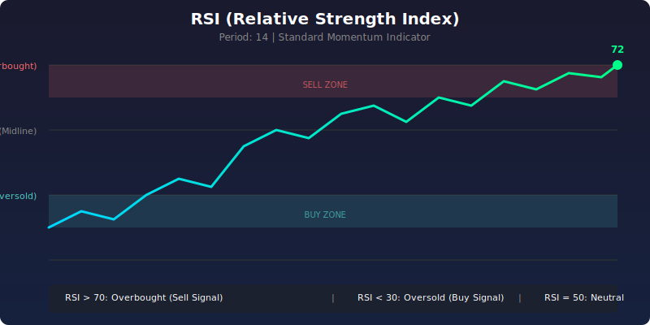
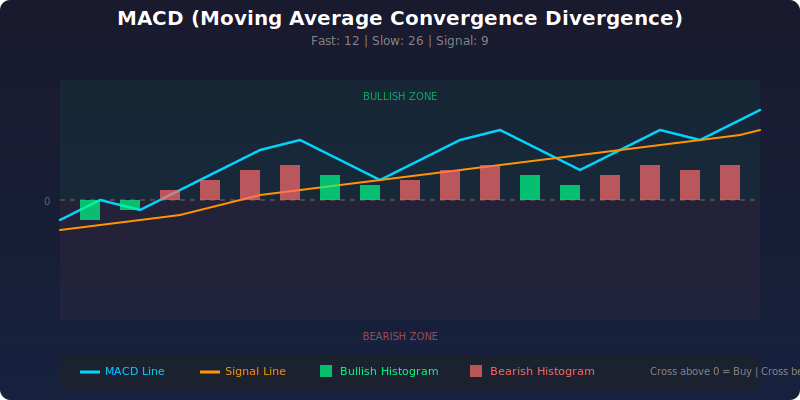
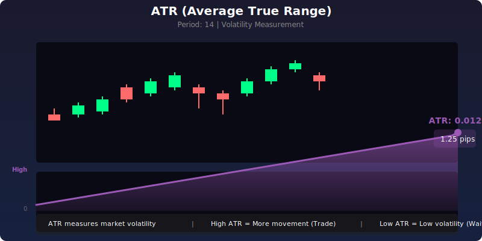

# Professional Trading Bots for MT5


> **Professional Trading Bots for Wise and Smart Traders**
> 
> Using large institution concepts and trading techniques

---

## Our Mission

We build **institutional-grade trading bots** that combine:
- **Large institution concepts** - Professional trading desk techniques
- **Market structure analysis** - Support/resistance, liquidity, order flow
- **Multi-confirmation signals** - Minimum 3 confirmations required
- **Proper risk management** - 1:2 Risk:Reward, proper SL/TP on ALL orders

> "We don't just trade - we execute with the precision of institutional traders."

---

## Trading Bots Available

### 1. SmartConsensus Pro v12.0 (Main Production Bot)

**Our flagshtip production-ready trading bot.**

```
Features:
├── All Order Types: Market, Limit, Stop, Stop-Limit
├── Timeframes: H1 (Trend) + M15 (Entry)
├── Daily Target: 10 trades per day
├── Confirmations: 2 required for execution
├── Risk:Reward: 1:3 (configurable)
├── Pending Orders: 12-hour expiry
├── No Auto-Close: Let orders fill or expire naturally
└── Fill Policy: IOC (Immediate or Cancel)
```

**Ideal For:** Continuous daily trading with multiple order types

---

> ⚠️ **Development Status**
> - ✅ **SmartConsensus Pro & Variants** (BTC, ETH, Forex, Gold, Oil) - **Fully Functional & Production Ready**
> - 🔄 **PriceAction Pro** - Under Development
> - 🔄 **SmartConsensus Resilient** - Under Development

---

### 2. PriceAction Pro (Pure Price Action)

**Stripped-down price action only version.**

```
Features:
├── Pure Price Action: No indicators needed
├── Candlestick Patterns: Pin bars, engulfing
├── Support/Resistance: Automatic detection
├── Trend: EMA 50/200 alignment
├── Conservative: Higher confirmation threshold
└── Best For: Price action traders
```

**Ideal For:** Traders who prefer pure price action over indicators

---

### 3. SmartConsensus Resilient (with Retries)

**Legacy version with progressive retries.**

```
Features:
├── Market Order Retries: Up to 3 attempts
├── Adaptive SL/TP: Dynamic distance adjustment
├── Spread Protection: Max spread filter
└── Best For: High-spread symbols
```

**Ideal For:** High-spread instruments (crypto, commodities)

---

## Order Types Explained

We teach you how institutions trade:

| Order Type | When to Use | Institutional Concept |
|-----------|------------|------------------|
| **Market** | Immediate entry when signal fires | "Get filled now" |
| **Buy Limit** | Buy below market (dip buying) | "Buy the dip" - Institutional buyers |
| **Sell Limit** | Sell above market (sell rips) | "Sell the rip" - Institutional sellers |
| **Buy Stop** | Breakout above resistance | "Momentum breakout" |
| **Sell Stop** | Breakdown below support | "momentum breakdown" |
| **Buy Stop Limit** | Breakout + retest confirmation | "Advanced confirmation" |
| **Sell Stop Limit** | Breakdown + retest confirmation | "Advanced breakdown" |

### Critical: Fill Policies

```mql5
// Always specify fill policy!
ORDER_FILLING_IOC   // Immediate or Cancel - Accept partial fill
ORDER_FILLING_FOK  // Fill or Kill - Full volume only
ORDER_FILLING_RETURN // Return - Keep remaining as pending
```

---

## Technical Indicators Used

Our trading bots utilize three primary technical indicators for signal confirmation and risk management:

### 1. RSI (Relative Strength Index)



| Parameter | Value | Purpose |
|-----------|-------|---------|
| Period | 14 | Standard momentum measurement |
| Overbought | > 70 | Sell signal / trend exhaustion |
| Oversold | < 30 | Buy signal / trend reversal |
| Midline | 50 | Trend direction filter |

**How We Use It:** RSI confirms momentum alignment. Both RSI and MACD must agree on direction before execution.

---

### 2. MACD (Moving Average Convergence Divergence)



| Parameter | Value | Purpose |
|-----------|-------|---------|
| Fast EMA | 12 | Short-term momentum |
| Slow EMA | 26 | Long-term momentum |
| Signal Line | 9 | Smoothed crossovers |
| Histogram | Difference | Momentum强度 |

**How We Use It:** MACD crossover signals combined with RSI confirmation provide high-probability entries.

---

### 3. ATR (Average True Range)



| Parameter | Value | Purpose |
|-----------|-------|---------|
| Period | 14 | Standard volatility measurement |
| Usage | SL/TP Sizing | Dynamic risk management |
| Filter | Range Expansion | Confirm market movement |

**How We Use It:** ATR determines stop-loss distance and Take-Profit targets. Trades only execute when ATR shows healthy volatility (range expansion > 1.15x).

---

> **Tip:** All three indicators work together - MACD gives direction, RSI confirms momentum, ATR manages risk.

---

## Technical Specifications

### Confirmation Score (Minimum 2 Required)

Each trade requires **2+ confirmations** from these 8 checks:

1. **Candle Pattern** - Bullish/Bearish candle formation
2. **Volume Spike** - Above 1.3x average
3. **Momentum** - RSI + MACD aligned
4. **Liquidity Sweep** - Recent high/low sweep
5. **Consolidation Break** - Tight range breakout
6. **Range Expansion** - ATR expansion > 1.15x
7. **Fair Value Gap** - Price gap filled
8. **Multi-Timeframe** - HTF + LTF aligned

### Risk Management

```mql5
// Always include SL/TP on EVERY order
input double Risk_Percent = 1.0;     // 1% max risk per trade
input double Reward_Risk_Ratio = 2.0;   // 1:2 RR minimum
input int Maximum_Spread = 3000;         // Max spread filter
input int Slippage = 100;            // Slippage tolerance
```

---

## Installation

1. **Download** the `.mq5` file
2. **Open** MetaTrader 5
3. **Press** `Ctrl+O` to open Files
4. **Navigate** to `Experts` folder
5. **Copy** the `.mq5` file
6. **Restart** MT5 or refresh Expert Advisors
7. **Drag** EA onto chart

---

## Market-Optimized Bots - Exness Broker Configuration (May 2026)

Specialized versions of SmartConsensus Pro optimized for specific markets with Exness broker calibrated settings:

### Asset Configuration Table

| Asset | Digits | ATR Filter (pts) | Max Spread (pts) | Slippage (pts) | Dollar/Pip Value |
|-------|--------|------------------|------------------|----------------|------------------|
| **Pro** (BTC config) | 2 | 35,000 | 4,500 | 2,000 | $350 ATR / $45 Spread |
| **BTC** (BTCUSD) | 2 | 35,000 | 4,500 | 2,000 | $350 ATR / $45 Spread |
| **ETH** (ETHUSD) | 2 | 1,500 | 1,200 | 800 | $15 ATR / $12 Spread |
| **Gold** (XAUUSD) | 3 | 3,000 | 2,500 | 1,500 | $3.00 ATR / $2.50 Spread |
| **Oil** (USOIL) | 3 | 350 | 150 | 100 | $0.35 ATR / $0.15 Spread |
| **Forex** (EUR/GBPUSD) | 5 | 100 | 60 | 50 | 10 Pips ATR / 6 Pips Spread |

### Trading Parameters (All Assets)

| Setting | Value | Purpose |
|---------|-------|---------|
| Daily Trade Target | 10 trades | Increased opportunity |
| Min Confirmations | 2 required | Faster execution |
| Risk:Reward | 1:3 | Professional ratio |
| SL Multiplier | 1.5× ATR | Dynamic stop loss |
| Min SL Multiplier | 1.5× ATR | Minimum stop distance |
| Max Broker Stop | 2.0× | Broker limit multiplier |
| Fill Policy | IOC | Immediate or Cancel |
| Trailing Start | 1.2× ATR | Profit lock threshold |
| Trailing Step | 0.6× ATR | Step increment |

### Bot-Specific Settings

#### 1. SmartConsensus_Pro.mq5 (Main Production Bot)
**Uses BTC configuration as default.**

| Setting | Value | Purpose |
|---------|-------|---------|
| Max Spread | 4,500 pts | Covers BTC volatility |
| Slippage | 2,000 pts | High slippage tolerance |
| ATR Filter | 35,000 pts | Ensures momentum |

#### 2. SmartConsensus_BTC.mq5 (Bitcoin)
**Optimized for BTCUSD with crypto-specific settings.**

| Setting | Value | Purpose |
|---------|-------|---------|
| Max Spread | 4,500 pts ($45) | Covers normal volatility |
| ATR Filter | 35,000 pts ($350) | Avoids flat ranges |
| Max Lot | **0.1** | Conservative (high value) |

#### 3. SmartConsensus_ETH.mq5 (Ethereum)
**Optimized for ETHUSD with altcoin considerations.**

| Setting | Value | Purpose |
|---------|-------|---------|
| Max Spread | 1,200 pts ($12) | Covers liquidity drops |
| ATR Filter | 1,500 pts ($15) | Filters minor spikes |
| Max Lot | **1.0** | Higher than BTC |

#### 4. SmartConsensus_Gold.mq5 (XAUUSD)
**Optimized for Gold trading on M15 timeframe.**

| Setting | Value | Purpose |
|---------|-------|---------|
| Max Spread | 2,500 pts ($25) | High for gold volatility |
| ATR Filter | 3,000 pts ($30) | Ensures healthy momentum |
| Max Lot | **0.1** | Low due to high nominal value |

#### 5. SmartConsensus_Oil.mq5 (Crude Oil)
**Optimized for Crude Oil (WTI/Brent) trading.**

| Setting | Value | Purpose |
|---------|-------|---------|
| Max Spread | 150 pts ($1.50) | Highly liquid market |
| ATR Filter | 350 pts ($3.50) | Ensures movement |
| Max Lot | **0.1** | Conservative |

#### 6. SmartConsensus_Forex.mq5 (EUR/GBPUSD)
**Optimized for major Forex pairs.**

| Setting | Value | Purpose |
|---------|-------|---------|
| Max Spread | 60 pts (6 pips) | Major pair liquidity |
| ATR Filter | 100 pts (10 pips) | Filters dead sessions |
| Max Lot | **1.0** | Higher for Forex |

> **Note:** The original `SmartConsensus_Pro.mq5` uses BTC configuration. Use the specialized versions for better performance per market.

---

## Upcoming Bots

We are developing more professional bots:

- [ ] **Scalping Pro** - Ultra-low latency scalper
- [ ] **Swing Trader** - Multi-day swing system
- [ ] **News Trader** - News event specialist
- [ ] **Grid Trader** - Market maker grid system
- [ ] **AI Enhanced** - Machine learning filters

---

## Why Professional Traders Choose Us

✅ **No emotional trading** - Rules-based execution  
✅ **Proper SL/TP** - Never trade without protection  
✅ **Multiple confirmations** - Filter out noise  
✅ **Institutional concepts** - How big banks trade  
✅ **Production ready** - Tested code, no debugging  
✅ **Multi-symbol** - Single EA on multiple charts  
✅ **12 trades/day** - Continuous opportunity  

---

## Disclaimer

**Trading involves risk.** Past performance does not guarantee future results. Always:
- Test on demo account first
- Use proper position sizing
- Never risk more than 1-2% per trade
- Understand the strategy before trading live

---

## License

MIT License - Free to use, modify, and distribute.

---

**For questions, support, or custom development:**
- Open an issue on GitHub
- Star the repository ⭐

**Build with precision. Trade with confidence.**

*SmartConsensus - Professional Trading Bots*